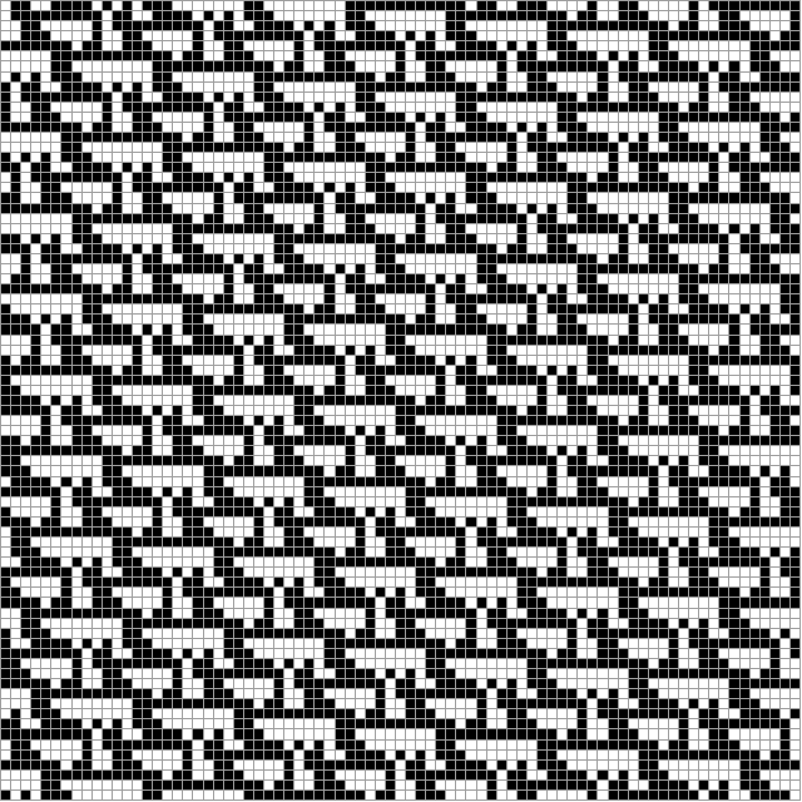

# Tiling Systems

This package implements tiling systems as described in
[Stephen Wolfram's A New Kind of Science](https://www.wolframscience.com/nks/p210--systems-based-on-constraints/).

Consider a set of tiles, for example,


Now, the problem is to tile a grid such that each 3x3 region corresponds to one of the tiles. For the tile to match, the
black and white cells have to match, and the gray cells can correspond to anything (they are not part of the mask).

For example, this periodic tiling is a solution:



`MinimalSetsSearcher.wl` contains Wolfram Language code to generate such tilings. For example, one can generate a
checkerboard pattern:

```wl
In[] := TilingStatePlot @ GenerateTiling[{{{0, 1}, {1, 0}}, {{1, 0}, {0, 1}}}, {}, 10]
```


Here `{{{0, 1}, {1, 0}}, {{1, 0}, {0, 1}}}` is the set of tiles, `{}` is the seed (a pattern that has to appear
somewhere at least once, which is not used in this example), and `10` is the size of the grid.

# Masks

Each tiling set belongs to a mask, which defines locations in its elements set to black or white. For example, the set
in the first example belongs to mask `{{0, 0, 1}, {1, 0, 1}, {0, 1, 1}}`, whereas the second example corresponds to
`{{1, 1}, {1, 1}}`.

We use a short form for masks, `ySize-xSize-id`, where `ySize` and `xSize` are the dimensions, and `id` is number with
binary digits corresponding to the digits in the representation above, for example, `001101011 = 107` and `1111 = 15` in
the examples above.

The full short forms for these examples are `3-3-107` and `2-2-15`.

# Minimal Tiling Sets

A tiling set is defined as tileable if it can tile the infinite grid. Further, a tiling set is considered minimal if it
is tileable, however, any of its subsets is not.

An interesting problem is to find all minimal tiling sets given a particular mask. The tool to solve this problem is
implemented in [minimal-tiling-sets](minimal-tiling-sets).

# minimal-tiling-sets

This tool is designed for large minimal-tiling-set-searching jobs and uses Dropbox API to synchronize both jobs and
results between multiple machines.

To use it, one has to connect it to a Dropbox account. It's not a production app currently, however, I will be happy to
add you as a development user on request. Alternatively, one can create a new app and change `dropboxAppKey` in
[`main.cpp`](minimal-tiling-sets/minimal-tiling-sets/main.cpp) accordingly.

Once that's done, one needs to install dependencies following [`provision.sh`](provision.sh) (which will work on Ubuntu, but will
need to be changed for other distros). Specifically, one needs:
* GCC
* Boost
* OpenSSL
* [cryptominisat](https://github.com/msoos/cryptominisat)
* [nlohmann's JSON for Modern C++](https://github.com/nlohmann/json)

Then, one can use [`build.sh`](build.sh) to generate the binary `bin/minimal-tiling-sets`.

To use it, one needs to put a file to `~/.minimal-tiling-sets` with the following contents:

```json
{
  "DropboxDataDirectory": "/path/on/Dropbox/to/store/results",
}
```

and put a file `tasks.json` into the same directory containing a single array of strings with short forms of the masks
that need to be evaluated, for example,

```json
[
  "1-3-3",
  "2-2-15",
  "3-3-325"
]
```

Then, one can run `bin/minimal-tiling-sets` (from multiple machines if desired), which will request Dropbox
authorization and then automatically split `tasks.json` between machines and start evaluating.

The results are synced to Dropbox every 5 minutes, and will appear in json files named after the masks. Note that the
executable will wait for new tasks after it's done, so it needs to be manually terminated.

If the executable is terminated, it can be restarted from the previously saved results.

# Understanding results

Consider `3-3-325.json` created in the previous section:

```json
{
  "IsDone": true,
  "MaximalGridSizes": {
    "251a": 6,
    "4000": 2,
    "4102": 4
  },
  "MinimalGridSize": 7,
  "PeriodLowerBounds": {},
  "Periods": {
    "0001": 1,
    "0116": 4,
    "0142": 3,
    "0214": 3,
    "0240": 4,
    "0420": 4,
    "1008": 4,
    "1886": 12,
    "2492": 12,
    "2814": 8,
    "2840": 3,
    "4182": 8,
    "4280": 3,
    "4924": 12,
    "6118": 12,
    "6880": 4,
    "8000": 1
  },
  "Version": 3
}
```

Here `"MaximalGridSizes"` represents tiling sets that do not tile the infinite grid, but do tile a grid up to the
specified size (it could be interesting to look at examples that tile large but only finite grids).

`"MinimalGridSize"` and `"PeriodLowerBounds"` are the variables used internally.

`"Periods"` is the most interesting one for us. The keys here are the minimal sets themselves, and the values are the
square grid sizes that these sets can tile periodically (thus proving they can tile an infinite grid).

The keys are hex numbers which, if written as binary, represents which tiling sets from a particular mask an elements of
the set. One can use code from `MinimalSetsSearcher.wl` to convert them to full tiling-set expressions. For example,

```wl
In[] := NumberToPatternSet[maskToAllPatterns[idToMask[{3, 3}, 325]]][FromDigits["1886", 16]]
Out[] = {
  {{0, _, 1}, {_, _, _}, {0, _, 1}},
  {{0, _, 1}, {_, _, _}, {0, _, 0}},
  {{0, _, 0}, {_, _, _}, {1, _, 1}},
  {{0, _, 0}, {_, _, _}, {1, _, 0}},
  {{0, _, 0}, {_, _, _}, {0, _, 1}}}
```

```wl
In[] := GenerateTiling[%, {}, 24, Boundary -> "Periodic"]
```


